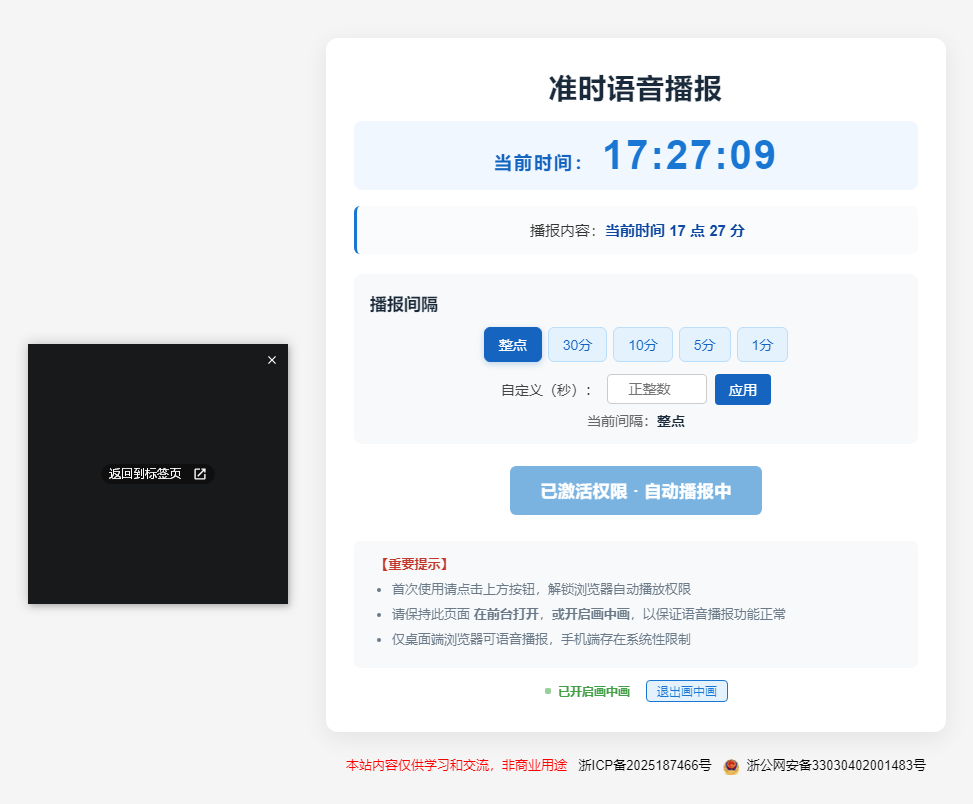

# 准时语音播报（HTML + JavaScript）

这是一个简单的网页应用，用于准时自动语音播报，并支持自定义间隔、画中画保活和手动播放当前时间的语音播报。

仅电脑端浏览器支持语音播报，手机端存在系统性限制。

演示地址：https://onehour.937788.xyz/

仓库地址：https://github.com/a937750307/one-hour-clock

## 功能说明

- **时间显示**：显示当前北京时间。
- **自动报时**：支持整点、每小时30分、每10分钟、每5分钟、每1分钟或自定义秒数自动语音播报。
- **手动播放**：点击“手动激活播放权限”按钮可立即播放当前实际时间的语音（如“当前时间 9 点 36 分”）。
- **自定义间隔**：可输入自定义秒数，实现任意间隔自动播报。
- **画中画保活**：支持一键开启浏览器画中画模式，页面可最小化为悬浮小窗，依然能保持自动播报和保活。不影响浏览其他页面。
- **状态提示**：画中画未开启时提示为红色“建议开启画中画”，开启后变为绿色“已开启画中画”。

## 技术栈

- HTML5
- CSS3
- JavaScript（使用浏览器内置的 `SpeechSynthesisUtterance` 实现文字转语音）
- 响应式设计（适配手机端与 PC 端）

## 使用方式

1. 将 `index.html` 文件部署到服务器或直接打开。
2. 首次使用请点击“手动激活播放权限”按钮以允许音频播放。
3. 如需后台运行或最小化页面，可点击“开启画中画”按钮，页面会以小窗悬浮，依然自动播报。
4. 系统将在设定的间隔自动播放语音。

## 注意事项

- 若使用 `SpeechSynthesisUtterance`，部分浏览器可能需要用户交互后才能播放语音。
- 画中画使用1帧空白画面，用极微弱的灰度变化保持视频流活跃，人眼无法直观看到变化，窗口的外观和透明度由浏览器控制，网页无法自定义。
- 若需使用本地音频，请将音频文件放置在 `/audio/` 目录下，并修改 JS 中的路径。

## 免责声明

本项目仅用于学习和交流，不涉及任何商业用途。请遵守相关法律法规。

